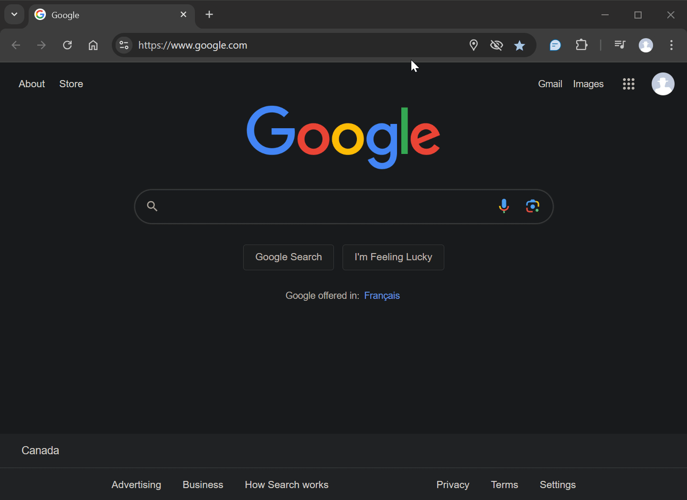

# AI Roundtable

This Chrome extension allows you to input your question once and have an answer from multiple AI assistants at once. You can customize which assistants you wish to ask your question.

## Demo

## ToDo

- [ ] Verify that user is logged into the services
- [ ] Auto expanding text input
- [ ] Voice input
